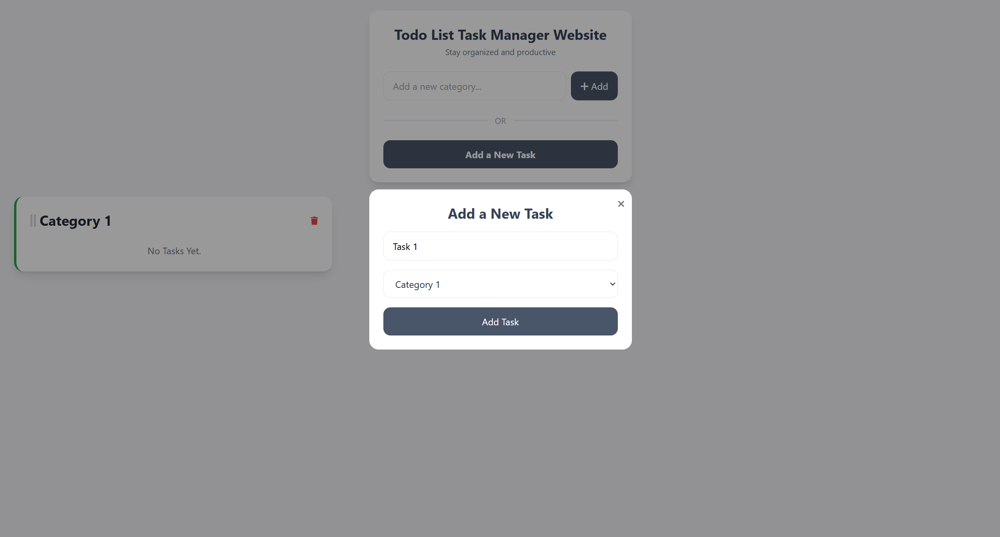
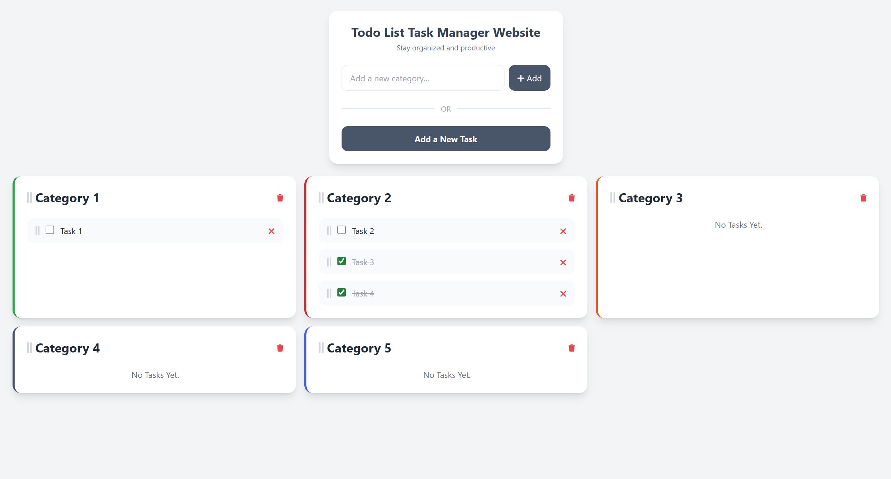

## ✅ Todo List Task Manager Web App


A modern task manager web app built with **Flask**, **SQLAlchemy**, **SQLite**, **Tailwind CSS**, and **SortableJS**.  
It allows users to create categories, add tasks, mark tasks as complete, delete tasks/categories, and drag tasks between
categories while keeping their order updated in the database.

---

### 🧠 Features:

- Add new categories
- Add new tasks through a modal
- Assign tasks to a selected category
- Mark tasks as completed/uncompleted
- Delete tasks/categories
- Drag and drop tasks inside a category
- Move tasks from one category to another
- Drag and reorder categories/tasks
- Automatically save updated task/category order in the database
- Flash messages for user actions and error handling
- Clean, responsive, minimal and modern UI using Tailwind CSS

---

### ⚙️ Tech Stack / Libraries:

- **Flask** - Backend web framework
- **Flask-SQLAlchemy** - ORM for database handling
- **SQLite** - Lightweight database *(Used for development, PostgreSQL is recommended for production)*
- **HTML + Jinja2 + Tailwind CSS + JS** - Frontend
- **SortableJS** - Drag and drop sorting
- **Font Awesome** - Icons

---

### 🗂️ Database Structure:

**Category Table:**

- `id`
- `name`
- `order`
- `tasks` (relationship)

**ToDo Table:**

- `id`
- `name`
- `order`
- `checked`
- `category_id`
- `category` (relationship)

**Relationship:**  
A category can have multiple tasks (One to Many Relationship)

---

### 📌 Example Screenshots:

#### Adding Task Modal:



#### Main Example:



---

### 🚀 How to Run:

```text
pip install -r requirements.txt
python main.py
```